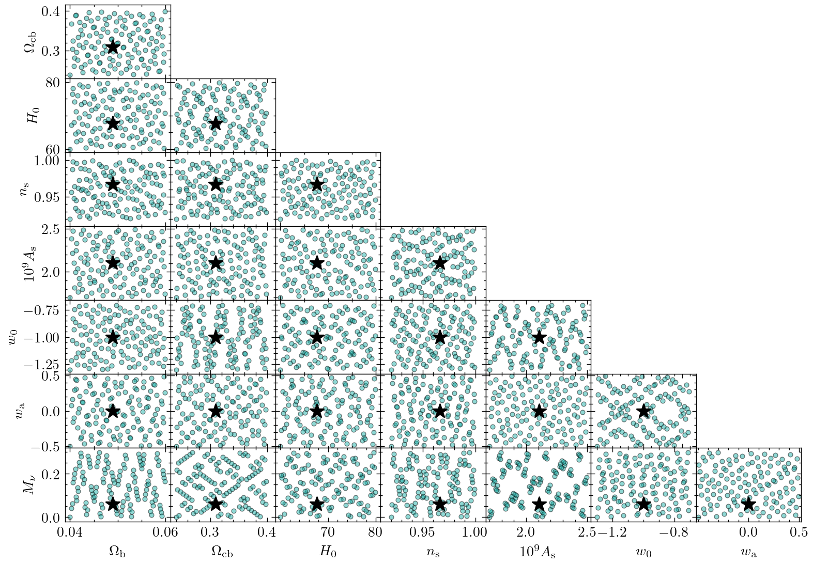

Cosmology
=========

The following is a listing of all cosmologies used in CSST trainning simulations.
You can also download the Parameter table as a `CSV file <https://github.com/czymh/csstemu/tree/dev/docs/source/csst_cosmo_params.csv>`__.
Note that the :math:`\Omega_M = \Omega_b + \Omega_c + \Omega_{\nu}`.
The particle mass only includes the cold dark matter and baryon mass, i.e., :math:`\Omega_b + \Omega_c`.

.. csv-table::
    :file: ./csst_cosmo_params.csv
    :header-rows: 1
    :escape: '

The c0000 cosmology is the fiducial cosmology selected from last column of Table 6 in `Planck18 paper <https://ui.adsabs.harvard.edu/abs/2020A&A...641A...6P>`__.
The other 128 cosmologies are generated by using the Sobol sequence sampling in `Scipy package <https://docs.scipy.org/doc/scipy/reference/generated/scipy.stats.qmc.Sobol.html#scipy.stats.qmc.Sobol>`__.
The corresponding plot is shown as follows:

   
