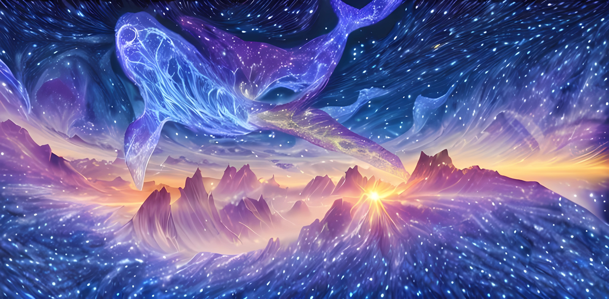

Welcome to Kun Universe!
=========================================

**Kun Universe** is an extensive simulation suite designed for the emulator construction of the China Space Station Telescope (**CSST**) optical survey `CSST Emulator <https://github.com/czymh/csstemu>_`.
In Chinese mythology, *Kun* (**鲲**) is an extraordinary and mythical creature. 
It is depicted as an immense fish dwelling in the boundless northern sea. 
*Kun* has an extraordinary ability - it can transform into a gigantic bird named *Peng* (**鹏**). 
This transformation is a symbol of great power and the potential for amazing change. 
The legend of *Kun* has been perpetuated through the ages in Chinese culture, symbolizing the grandiosity of nature and the infinite possibilities within the realm of mythology and human imagination.
We earnestly hope that the **Kun Universe** will grow to an enormous scale and possess rich variability. 
Wish this suite can offer you a novel perspective on the universe and the future of cosmology!

**Kun Universe** includes **129** high-resolution N-body simulations, which are generated by 
the modified version of the `Gadget-4 <https://github.com/czymh/C-Gadget4>_` code with **129** different cosmologies.
The broad ranges of cosmological parameters are shown as followed.

+-------------------------------+-------------+-------------+
| Parameter                     | Lower Limit | Upper Limit |
+===============================+=============+=============+
| :math:`\Omega_b`              | 0.04        | 0.06        |
+-------------------------------+-------------+-------------+
| :math:`\Omega_{cb}`           | 0.24        | 0.40        |
+-------------------------------+-------------+-------------+
| :math:`H_0`                   | 60          | 80          |
+-------------------------------+-------------+-------------+
| :math:`n_s`                   | 0.92        | 1.00        |
+-------------------------------+-------------+-------------+
| :math:`A_s\times 10^{9}`      | 1.7         | 2.5         |
+-------------------------------+-------------+-------------+
| :math:`w`                     | -1.3        | -0.7        |
+-------------------------------+-------------+-------------+
| :math:`w_a`                   | -0.5        | 0.5         |
+-------------------------------+-------------+-------------+
| :math:`\sum M_{\nu}`          | 0           | 0.3         |
+-------------------------------+-------------+-------------+

The detailed cosmologies can be found in the :doc:`cosmologies` section.

Contents
--------

.. toctree::
   :maxdepth: 4
   :caption: Data

   cosmologies
   dataproducts
   visualization

Acknowledgement
---------------

Feel free to contact <chyiru@sjtu.edu.cn> or leave an issue on the GitHub if you have any questions.
